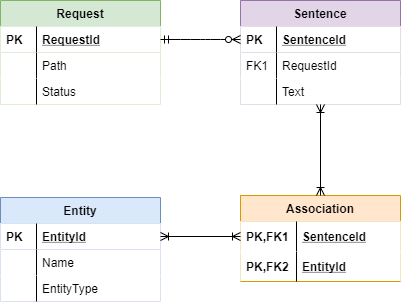

# Fast NER WebService
## About
Fast NER WebService is a docker-ready Python-based web service written in [FastAPI](https://fastapi.tiangolo.com/) framework that provides the following key features:
+ Submit request to scrape text body of provided URL path and store sentences into a database.
+ Perform named entity extraction and store extracted entities into database.
+ Allow retrieval of stored entities from database.
+ Allow retrieval of relevant text sentences containing provided entity.

## How to Run
### Method 1: Google Cloud Run
[](https://deploy.cloud.run?git_repo=https://github.com/kkaryl/fast-ner-service/fast-ner-service.git)

### Method 2: Docker Run
Use the provided Dockerfile to build a Docker image for running the service.
```shell script
docker build -t ner-service .
docker run -p 8000:8000 ner-service
```

### Method 3: Uvicorn Run (from Source)
If you wish to run from source, you will need to pip install all the dependencies from **requirements.txt** before running the following command:

```shell script
uvicorn app.main:app --reload-dir app
```

## Source Code Structure
The source codes are structured in the following manner:
+ **app** folder: contains codes for the web API
    + **api** folder: contains api routers
    + **db** folder: contains SQLAlchemy models and Pydantic schemas
    + **service** folder: contains business logic e.g. web scraping service, nlp service
    + Also contains main.py, Dockerfile, requirements.txt
+ **tests** folder: contains pytest scripts


## Persistence Design
For simplicity, SQLite is used as the persistence storage for the webservice.



The ER diagram above shows the relationships between the ORM objects, namely Request, Sentence, Association and Entity. As FastAPI supports SQLAlchemy ORM mapping, the tables are mapped into object models for lazy loading.

## General Workflow

To begin the process of named entity extraction, the user shall submit a request via the API service. This request will contain a path to the URL for text extraction. The request path will be verified as a valid URL prior to queuing it for processing by the scraper service. The scraper service will handle the requests made to extract text body from URL. It uses BeautifulSoup4 for web scraping. 

Once the text body is extracted, the scraper service will pass it to the NLP service to perform tokenization of sentences and extraction of named entities using SpaCy. If named entities are found in the extracted sentences, the entities along with the sentence will be created in the database. These entities will be linked with the sentence via Association table. In the event when the named entity is already in the Entity table, only the sentence and the association link will be added to the database. Once the processing is completed, the request will be marked as "Success" status. 

Users can also get requests made for status update, get sentences from requests, get all extracted entities and the sentences they belonged to using the API service.

### Error Handling

During every webservice startup, all "running" requests in database will be marked as "Error" status. This is to prevent locked requests in the event of an abrupt disruption that causes the webservice to terminate unexpectedly. User may submit the request again for re-processing for requests of "Error" state.

### Assumptions
The following assumptions made during the creation of this webservice:
+ **All** text will be extracted for NER as long as the <u>do not</u> belong in the following tag parents:
    + [document]
    + 'noscript'
    + 'header'
    + 'html'
    + 'meta'
    + 'head'
    + 'input'
    + 'script'
    + 'style'
    + 'link'
+ Only entities of the following entity **labels** will be stored into the database:
    + 'PERSON'
    + 'ORG'
    + 'GPE'
    + 'PRODUCT'
    + 'EVENT'
    + 'LANGUAGE'
    + 'FAC'
    + 'NORP'

## OpenAPI Documentation
Please find the OpenAPI documentation at:
+ Version 1: http://localhost:8000/v1_0/docs

or the latest openai.json file in directory.